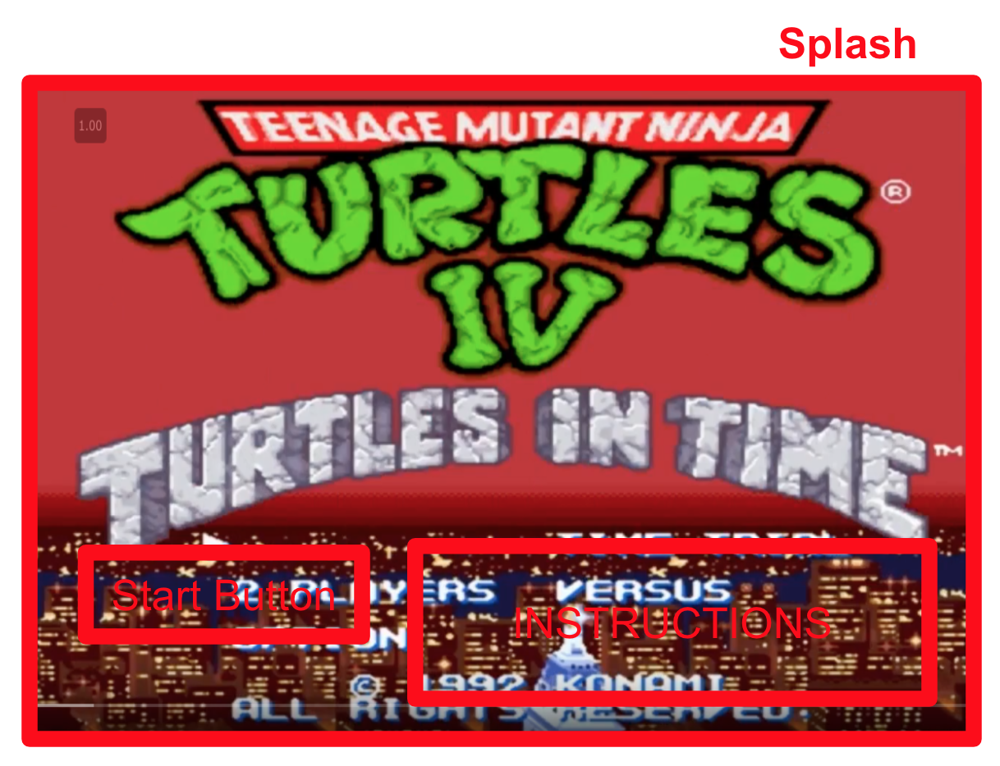
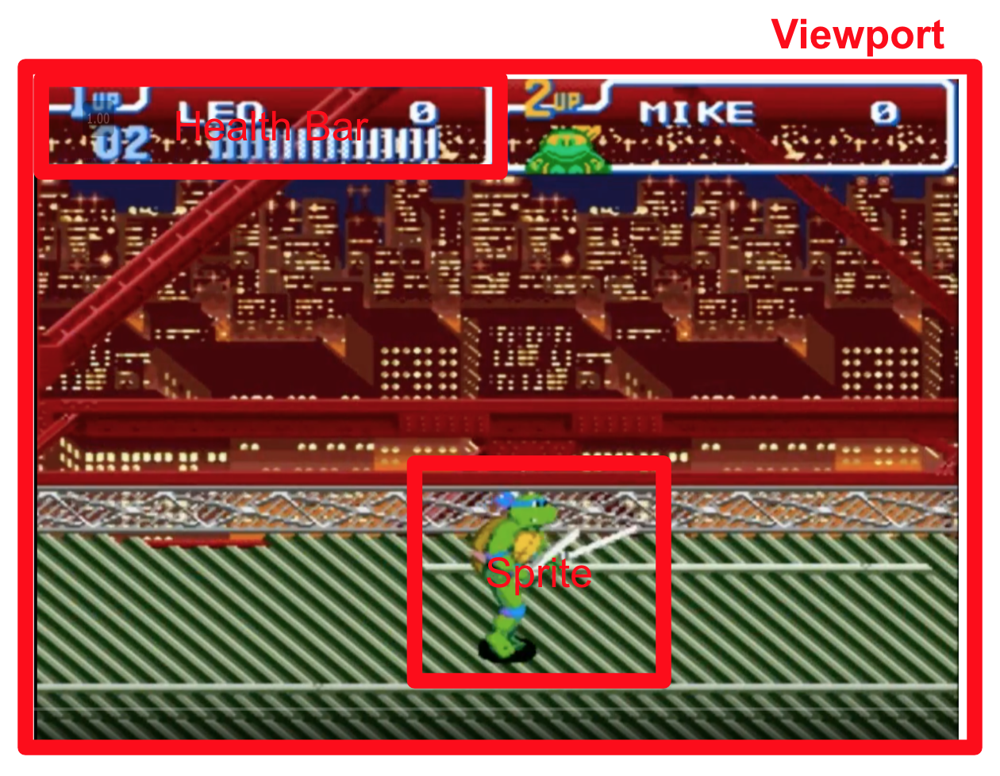

# TMNT Lite

## MVP

This game is a simplified version of TMNT 4: Turtles in Time, which is a classic "beat 'em up" 2D scroller game on SNES. The following are the MVP features:

1. Start, pause, and reset the game
2. Turtle walking and jumping from left to right (by moving the background backwards)
3. Foot soldiers entering screen from right
3. Turtle killing a foot soldier with a combo attack controlled by keypress

## Technologies and Libraries

This project will be implemented with the following technologies:

- `JavaScript` for game logic
- `React` for animation and rendering

These are the basic outline of components to be created:

#### Gameframe
- fix frame width and size
- contains nav links and instructions
- starts and ends the game loop

#### Viewport
- tracks and centers the view based on turtle pos

#### Stage
- renders turtle
- populates foots at random pos (redux)

#### Turtle
- tracks its own pos relative to stage (redux)
- tracks its half length (redux)
- tracks health (redux)
- keypress event handlers
- sprite state (redux)
  1. Walk
  2. Stand
  3. Attack
- Note: if turtle is attack and foot is stand, and dist betw centers <= half lengths, then foot loses health

#### Foot Soldier
- tracks pos relative to stage (redux)
- tracks health (redux)
- sprite state (redux)
  1. Stand
  2. Attack

#### Physics util/Character parent class?
- jump physics

### Technical challenges
1. Inifinite scrolling of background to simulate walking forward
2. Rendering animated sprite characters in the viewport
3. Physics of jumping
4. Collision logic for attacks and non-attacks
5. Storing/tracking health of turtle and foot soldiers

## Wireframes

This app will have a splash screen with the Start button, instructions and links to my Github and LinkedIn.

The app will enter into the main viewport when the user starts the game.

## Implementation Timeline

### Day 1:
Setup all necessary Node modules, including getting webpack up and running. Write a basic entry file and the bare bones of scripts. Goals for the day:

- define a viewport with fixed width and height
- infinite scroll of the viewport's background
- render walking turtle sprite
- render foot soldier sprite

### Day 2:
Come up with a logic for the physics of jumping and response to keypress. Create and test jumping. Implement the response to keypress for turtle to attack. Randomize foot soldier attacks. Goals for the day:

- turtle responds to keypress for 'jump' action
- turtle jumps based on game physics
- turtle responds to keypress for 'attack' action
- renders attack sprites for both turtle and foot soldiers

### Day 3:
Come up with a logic for attack and non-attack collisions. Implement mechanism to track health of turtle and foot soldiers:

- characters respond to attacks based on collision logic
- character health decreases when attacked, and dies when health depletes

### Day 4:
Implement controls for user to start, pause and reset the game. Style the frontend, making it polished and professional. Goals for the day:

- Create controls for start, pause and reset
- Finalize Repo and Readme

## Bonus features
- Add option to select any of the 4 turtles
- Jump attack
- Boss level
